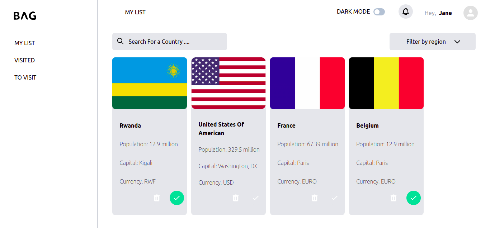
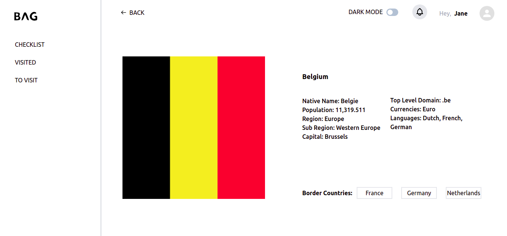

# Bag Coding Challenge





## Prerequisites

```
  - NodeJS
```

## Installation

```
  - Clone the repository `https://github.com/dushimeemma/fn-bag-challenge`
  - Run `yarn install` to install node packages
  - Run `yarn dev` to start the web app
```
